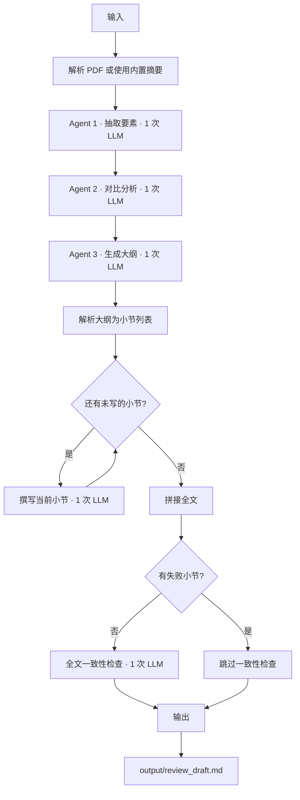

# PaperReview Agents — 多Agent协作论文综述生成器

一个基于多 Agent 协作与长链推理的学术论文自动精读及综述生成工具，旨在解决学生阅读多篇顶会论文并撰写综述时耗时且易遗漏矛盾的痛点。

## 系统架构

- **Agent 1 – 翻译抽取 Agent**：从论文（摘要或全文）提取背景、方法、实验、局限四要素
- **Agent 2 – 对比分析 Agent**：横向对比多篇论文，输出异同、共有缺陷和互补方向
- **Agent 3 – 综述撰写 Agent（长链推理）**：先规划综述大纲，再逐节扩写，自动插入引用序号，输出完整 Markdown 草稿

整个流水线串行协作，人工仅需最终复核与润色。

## 技术栈

| 组件 | 说明 |
|------|------|
| Python 3 | 主语言，无额外框架 |
| OpenAI SDK | 调用大模型，支持通过环境变量对接任意 OpenAI 兼容接口 |
| PyMuPDF | 从 PDF 文件中抽取文本 |
| python-dotenv | 从 `.env` 文件加载环境变量 |

## 工作流程



**LLM 调用次数**：1（抽取）+ 1（对比）+ 1（大纲）+ N（逐节，N = 小节数）+ 1（一致性检查）

## 运行示例

以下是使用 `--demo` 模式（3 篇内置 CV 领域论文摘要，MiMo v2.5 Pro）的真实运行日志：

```
>>> DEMO 模式：使用内置论文摘要
正在提取：Improving Image Classification via Attention-Augmented CNNs
正在提取：Vision Transformers for Large-Scale Image Recognition
正在提取：Efficient Hybrid Models: Combining CNNs and Transformers

>>> 正在进行论文横向对比分析...
对比分析完成

>>> 正在生成综述大纲...
大纲已生成，开始撰写全文...

  已解析出 5 个小节
  正在撰写第 1/5 节：图像分类模型演进：背景、现状与范式对比
  正在撰写第 2/5 节：深度学习方法详析：原理、性能与效率权衡
  正在撰写第 3/5 节：优化与突破：面向轻量化、泛化性与可解释性的未来研究方向
  正在撰写第 4/5 节：范式拓展与理论深化：自适应、自监督与跨模态学习的未来展望
  正在撰写第 5/5 节：结论：融合范式智慧，构建下一代视觉理解系统
  正在进行全文一致性检查...
 综述已保存至 output/review_draft.md
```

生成的综述草稿（前 2 个小节）：

```markdown
## 图像分类模型演进：背景、现状与范式对比

近年来，深度学习在图像分类领域的突破主要围绕三种技术路线展开：基于注意力机制增强的卷积神经网络（CNN）、纯Transformer架构以及CNN-Transformer混合模型。这三种范式代表了从局部特征优化到全局建模探索，再到多架构融合的演进脉络，共同推动了图像表征学习的理论发展与性能提升。

以论文[1]为代表的注意力增强CNN路线，其核心创新在于将显式的注意力模块（如通道、空间或混合注意力）嵌入经典CNN架构（如ResNet）中。该方法旨在弥补CNN在建模特征间依赖关系和选择性聚焦关键信息方面的不足，通过为特征图赋予自适应权重来增强判别性特征。然而，该方法的局限性在于：注意力模块的引入增加了模型复杂度和计算开销；其作用机制多为后验增强，与CNN固有的层级特征提取过程结合方式仍有优化空间；其归纳偏置依然强烈依赖于CNN的局部性与平移不变性假设。

纯Transformer路线（以论文[2]为代表）则试图彻底摒弃CNN的架构范式，验证Transformer作为图像分类通用主干网络的潜力。其重大创新在于证明了基于自注意力机制的Vision Transformer（ViT）在获得足够大规模数据预训练的前提下，能够达到甚至超越顶尖CNN模型的性能。它通过将图像分割为序列化的图元（Patch）并利用多头自注意力机制直接建模全局依赖关系，从而具备了强大的上下文感知能力。但该路线的突出缺陷在于"数据饥渴"：缺乏CNN固有的归纳偏置，使得模型在中小规模数据集上难以充分训练，性能往往不如有归纳偏置先验的模型。同时，其对计算资源的需求通常更高，模型可解释性也相对更弱。

作为对前两种路线的折中与发展，CNN-Transformer混合架构（如论文[3]所探讨）应运而生。其设计哲学是有机结合CNN强大的局部特征提取能力和Transformer卓越的全局依赖建模能力。典型设计是利用CNN作为前端特征提取器，将得到的特征图序列化后输入Transformer层进行关系推理。这种方法的创新在于试图以更少的参数和计算量，在不依赖超大规模数据的情况下，逼近纯Transformer的性能，从而平衡效率与效果。然而，混合架构也面临挑战：CNN与Transformer两个分支如何高效交互、信息如何无缝流转，其设计复杂度较高，且固定的融合模式可能缺乏自适应性；同时，整体架构的优化与训练策略也需要精心设计。

综合对比三篇论文可见，三者在提升模型表征能力、关注特征质量与追求更高分类准确率的核心目标上高度一致。然而，它们在架构哲学上存在根本分野：论文[1]坚守CNN范式，通过内部增强进行优化；论文[2]倡导范式革新，探索新的主导架构；论文[3]则采取务实融合策略。在效率权衡方面，论文[1]与论文[2]均存在计算开销增加的问题，而论文[3]则明确将参数效率作为设计考量之一。此外，论文[2]完全抛弃了CNN的归纳偏置，而论文[1]与论文[3]则在不同程度上保留了CNN的局部敏感特性。这些差异共同勾勒出图像分类模型从"单一架构优化"到"新范式探索"再到"混合架构整合"的清晰演进轨迹。

## 深度学习方法详析：原理、性能与效率权衡

基于前述背景，本节将深入分析三种技术路径的核心原理、创新贡献与内在局限，并从性能与效率权衡的视角进行横向综合比较。
```

（此处省略后续小节，完整输出见 output/review_draft.md）

## 快速开始

### 安装依赖

```bash
pip install -r requirements.txt
```

### 配置 API Key

```bash
# 复制环境变量模板
cp .env.example .env
# 编辑 .env，将 sk-your-api-key-here 替换为你的真实 API Key（OpenAI 或兼容接口）
```

若使用 OpenAI 兼容接口（第三方中转、DeepSeek、通义千问等），需在 `.env` 中额外指定平台地址与模型名：

```bash
OPENAI_BASE_URL=https://your-endpoint.example.com/v1
OPENAI_MODEL=your-model-name
```

### 运行

```bash
python main.py --demo                              # 内置示例论文，无需准备 PDF
python main.py paper1.pdf paper2.pdf               # 指定 PDF 运行
```

## 设计决策

### (a) 为什么放弃「一次 prompt 生成全文」，改成「先规划大纲再逐节生成」

**问题**：让 LLM 一次性输出完整综述，文本越到后面质量越衰减，各小节之间还容易出现内容重复和引用编号混乱。

**做法**：拆成「大纲 → 逐节撰写」两阶段。大纲只负责规划结构，逐节时每次只专注写一个小节，并带上完整大纲保证不跑题。

**效果**：每个小节独立生成、独立控制质量；同时引用编号规则在每次 prompt 中重复强调，保证全文统一。

### (b) 为什么每节生成时要带「前文各节的标题 + 正文前 200 字」

**问题**：逐节生成后各小节可能缺乏连贯性，后面的章节不知道前面写了什么，容易重复论述。

**做法**：每次撰写新小节时，把已写完的每一节的标题和正文前 200 字拼进 prompt 作为上下文。

**效果**：既让 LLM 了解前文内容以保持衔接和避免重复，又不会把 prompt 的 token 数撑爆（每节只取前 200 字，不是全文）。

### (c) 为什么「任一小节失败就跳过最后的一致性检查」

**问题**：某个小节生成失败时，系统会写入占位文本「（本节生成失败，请人工补写）」。但最后的一致性检查会重新输出全文，把这句占位标记覆盖掉，导致输出中看不出哪里失败了。

**做法**：记录所有失败小节的标题；拼接全文后如有失败小节，直接返回拼接结果，跳过一致性检查。

**效果**：失败标记能保留在最终输出中，提醒人工补写，不会被静默吞掉。

## 项目结构

```
paper-review-agents/
├── main.py                     # 主流程入口；demo 模式使用 3 篇内置论文摘要，PDF 模式截取前 3000 字符
├── requirements.txt            # 依赖清单
├── .env.example                # 环境变量配置模板
├── .gitignore
├── agents/
│   ├── __init__.py
│   ├── extract_agent.py        # Agent 1：抽取论文四要素（背景/方法/实验/局限），1 次 LLM 调用
│   ├── compare_agent.py        # Agent 2：横向对比多篇论文，1 次 LLM 调用
│   └── synthesis_agent.py      # Agent 3：大纲生成 → 大纲解析 → 逐节撰写 → 一致性检查
└── utils/
    ├── __init__.py
    ├── llm_client.py           # OpenAI SDK 封装；支持 OPENAI_BASE_URL / OPENAI_MODEL 环境变量
    └── pdf_parser.py           # PyMuPDF 封装，抽取 PDF 全文文本
```

## 已知限制

- **PDF 只取前 3000 字符**：长论文的实验、讨论等后半部分内容会丢失，提取质量受限于这个截断长度。
- **适合小规模综述**：当前设计面向 3–5 篇论文的场景，论文数量过多时逐节调用次数线性增长，耗时和成本会显著上升。
- **输出是草稿**：生成的综述仍需人工复核事实准确性、补全论证逻辑、润色语言表达，不能直接用于正式提交。
- **引用格式未规范化**：正文中的引用编号为 `[1][2][3]` 自动序号，未按照 GB/T 7714、APA 等标准格式生成参考文献列表。

## 许可证

本项目基于 [MIT 许可证](LICENSE) 开源。